<div align="center">
<p>
 
 <p align="center"><b><font size=6>RTMP、WebRTC、ffmpeg</font></b></p>
 <p align="center"><b></b></p>
</p>


[](LICENSE)

<div align="left">
<!-- 顶部至此截止 -->
[toc]

# 前置知识

> 学习路线参考：
>
> https://www.0voice.com/uiwebsite/html/courses/av.html
>
> 
>
> 视频教程：
>
> https://ke.qq.com/course/3202131#term_id=103329919
>
> 
>
> 文字教程
>
> https://ffmpeg.xianwaizhiyin.net/
>
> 
>
> 安装 ffmpeg4.2
>
> https://juejin.cn/post/7074487874451668999
>
> 安装后测试：
>
> ```
> ffplay rtmp://ns8.indexforce.com/home/mystream
> ```

## 知识体系

**音视频基础：**

- 图像色彩空间 RGB、YUV、HSL/HSV
- 视频格式、编解码算法 H.264、H.265、AV1、VP8、VP9
- 音频格式、编解码算法 PCM、AAC、MP3、g711、g726、adpcm
- 视频容器 MP4、MOV、MKV、FLV
- FFmpeg 音视频编解码
- 音视频合并封装
- 硬件编解码 MediaCodec、VideoToolBox、qsv、NVIDIA
- 音频处理、降噪、滤波器


**音视频直播流媒体：**

- 流媒体协议 RTMP、RTSP、RTP、RTCP、HLS、TS、SRT、SIP
- WebRTC 直播连麦、视频会议
- 流媒体直播转发服务器
- P2P 点对点流媒体直播
- VOIP 视频通话


## 术语

 **RTMP（Real Time Messaging Protocol）：**

- **定义**：RTMP是“实时消息传输协议”的缩写，最初由Macromedia开发，后来被Adobe收购。它主要用于在Flash**播放器和服务器之间传输音频、视频和其他数据**。
- **特点：**
    - **低延迟**：RTMP非常适合实时应用，如直播，因为它能够快速传输数据。
    - **广泛支持**：许多流媒体服务器和播放器都支持RTMP。
    - **适应性**：它支持不同的数据传输速率，适应用户的网络条件。

---

**WebRTC（Web Real-Time Communication）：**

- **定义**：WebRTC是一个开源项目，旨在通过简单的API在网页浏览器中实现**实时通讯**功能，包括视频聊天、语音通话和P2P文件分享等。
- **特点：**
    - **无插件**：在支持WebRTC的浏览器中，用户无需安装任何插件即可进行实时通信。

- **高度互动**：提供低延迟的音视频通信，非常适合视频会议、在线教育和实时游戏等应用。
- **端到端加密**：通信过程中的数据安全性得到了保障。
- **广泛兼容**：得益于其开源特性，WebRTC得到了多个主流浏览器的支持，包括Chrome、Firefox、Safari等。

---

**FFmpeg：**

- **定义**：FFmpeg是一个开源的音视频处理**工具集**，用于录制、转换和流化音视频。它包括了众多的音视频编解码器、滤镜和格式转换器。
- **特点：**
    - **功能强大**：支持几乎所有的音视频格式，可以进行编码、解码、转码、混流、滤镜处理等。
    - **高效率**：优化的算法确保了处理速度快，资源占用少。
    - **灵活性**：适用于各种不同复杂度的音视频处理任务，从简单的格式转换到复杂的视频编辑。
    - **广泛应用**：在视频编辑、直播、视频会议等多个领域有着广泛的应用。

---

**PCM：**
PCM 表示脉冲编码调制（Pulse Code Modulation），它是一种用于**数字音频编码的方法**。在 PCM 中，模拟音频信号被离散化和量化，然后转换为数字形式。这个过程包括两个主要步骤：脉冲编码和量化。

1. **脉冲编码（Pulse Code）：** 连续的模拟信号在时间上被离散成小的时间片段，每个时间片段称为样本。这些样本被量化并用数字表示。
2. **量化（Modulation）：** 样本的幅度被量化，即将连续的模拟信号的幅度映射到离散的数字值。这就是所谓的量化过程，它决定了数字表示的精度和动态范围。

PCM 是一种常见的数字音频编码方式，用于将模拟音频信号转换为数字形式，以便在数字系统中进行处理、传输和存储。在 PCM 中，音频信号被表示为一系列离散的采样值，这些值以固定的时间间隔被记录下来。PCM 在许多音频应用中广泛使用，包括 CD、DVD、蓝光光盘等。


## 音视频解码流程



1. **解复用器**：按一定规则将音频包和视频包取出来。比如音频是 AAC，视频是 AVC（H.264）
2. **音频解码和视频解码**：注意，音频解码和视频解码是分别单独进行的。
3. **音视频输出**：是通过 SDL 库进行的。并且在这时**要在一个==线程==里进行音视频同步**，或者音视频处理（比如音频变调、图形缩放、图像变亮等）


